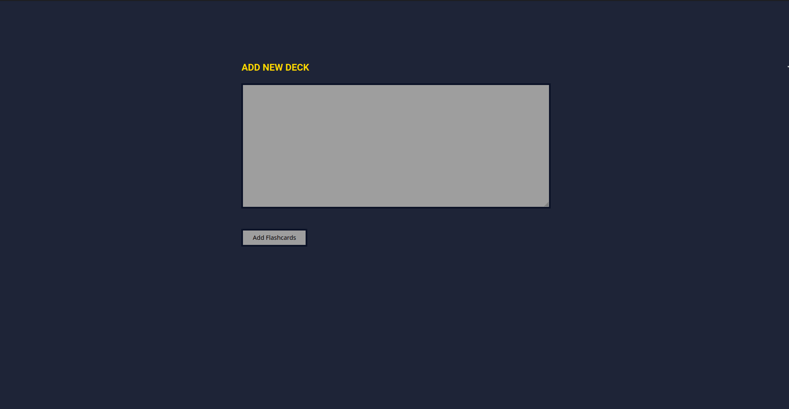

# Flashcards

- This project gives an easy interface for learning new sets of flashcards (named `decks`).
- Features:
    - Inserting valid json with flash card questions and answers into textarea
    - While adding, the flashcards variable in the state will be updated
    - When there are are cards available, the front of the first card will be shown in frontend
    - You can navigate to next or previous card, or just remove cards which you've already learned
    - When hovering over a card, you will see the back of the card

> Next idea is to store decks in a PostgreSQL database...

 

# Showcase

